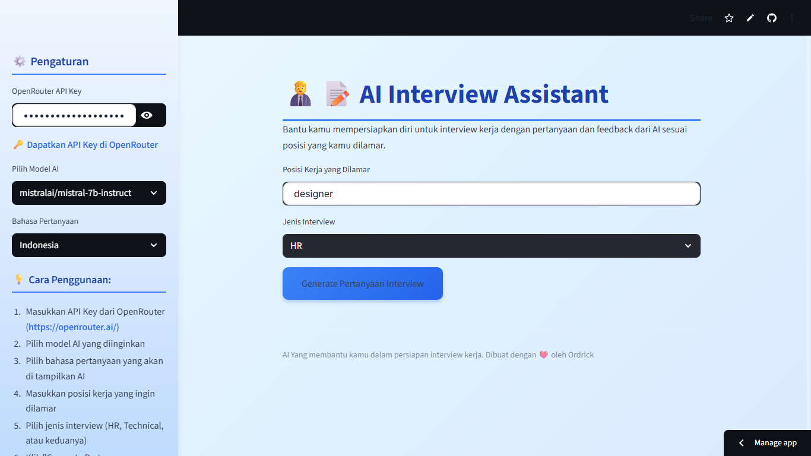

# 🧑‍💼📝 AI Interview Assistant

## Deskripsi Singkat
AI Interview Assistant adalah aplikasi berbasis web yang membantu pengguna mempersiapkan diri menghadapi interview kerja. Latar belakang masalahnya adalah kurangnya simulasi interview yang realistis dan feedback yang objektif. Tujuan aplikasi ini adalah memberikan pertanyaan interview serta evaluasi jawaban secara otomatis menggunakan Artificial Intelligence sesuai posisi dan jenis interview yang dipilih.

---

## Fitur-Fitur Utama
- Input OpenRouter API Key secara aman
- Pemilihan model AI (Mistral, Qwen, GPT-4o-mini)
- Pemilihan bahasa pertanyaan (Indonesia / Inggris)
- Generate pertanyaan interview berdasarkan posisi kerja
- Pilihan jenis interview (HR, Technical, HR & Technical)
- Input jawaban interview oleh pengguna
- Feedback AI berupa penilaian dan saran perbaikan
- Tombol reset untuk mengulang simulasi interview
- Tampilan UI modern dengan custom CSS

---

## Cara Menjalankan di Lokal

### 1. Clone Repository
```bash
git clone https://github.com/ordrickv/final_project_REAPYTHON5PZHRB.git
cd final_project_REAPYTHON5PZHRB

````

### 2. Install Dependency

```bash
pip install streamlit requests
```

### 3. Jalankan Aplikasi

```bash
streamlit run app.py
```

---

## Preview Aplikasi

Berikut adalah tampilan utama aplikasi AI Interview Assistant:



---

## Link Deploy Aplikasi

Aplikasi dapat diakses secara online melalui link berikut:

🔗 [https://ordrick-ai-interview-assistant.streamlit.app/](https://ordrick-ai-interview-assistant.streamlit.app/)

---

© 2026 — AI Interview Assistant
Dibuat sebagai Bootcamp Final Project berbasis Python & Streamlit.

```
```
